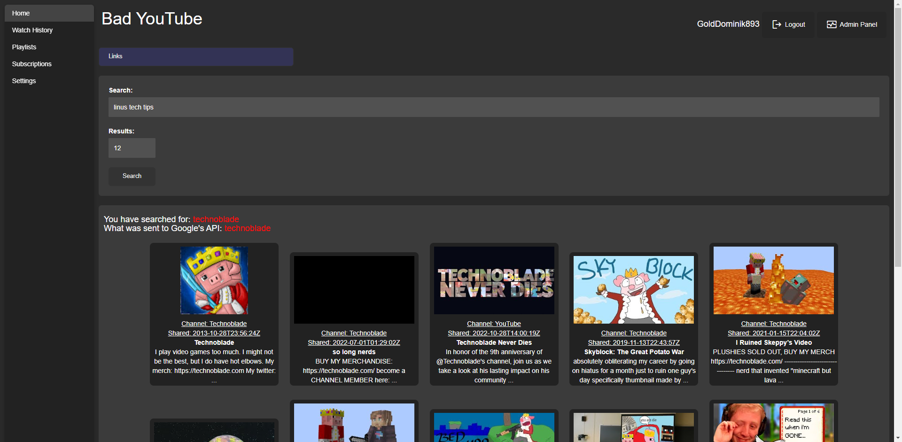
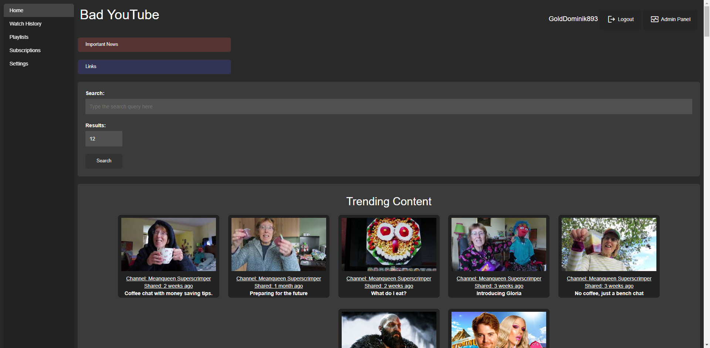
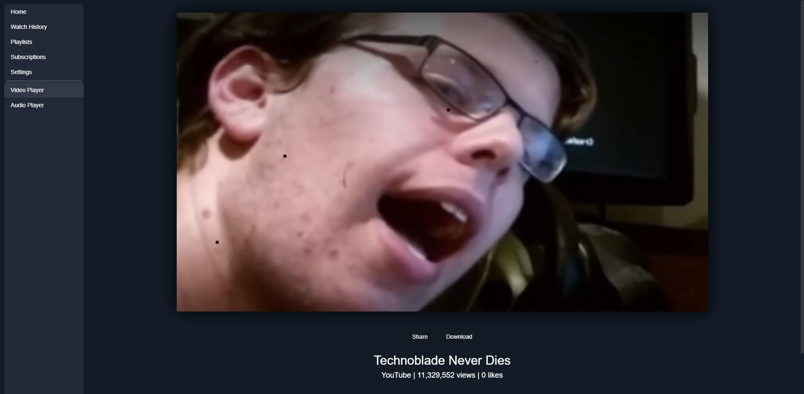
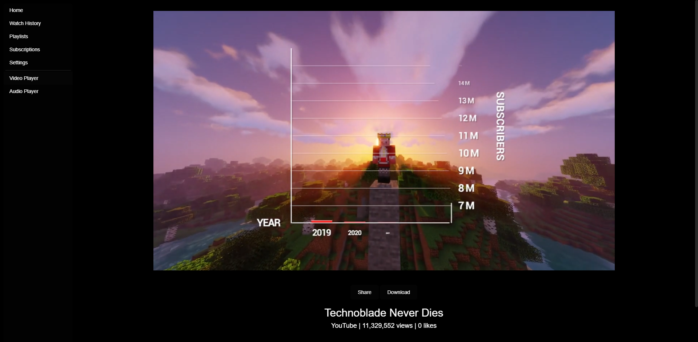
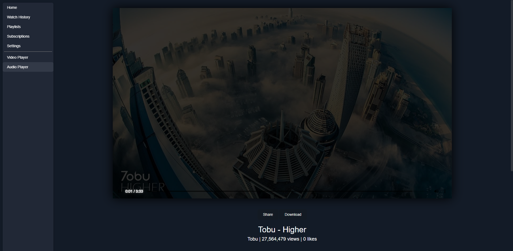

<div style="align: center;">

</div>

<a href="https://www.gnu.org/licenses/agpl-3.0.en.html">
    
  </a>
  <a href="https://github.com/iv-org/invidious/commits/master">
    
  </a>
  <a href="https://github.com/iv-org/invidious/issues">
    
  </a>
  <a href="https://github.com/iv-org/invidious/pulls">
    
  </a>

## A YouTube alternative like Invidious but in PHP but uses the YouTube API v3 to get search results from YouTube.

## Screenshots
#### Search page 
</img>
#### Trending content page
</img>
#### Video player with blue theme
</img>
#### Ultra dark theme
</img>
#### Audio player
</img>

## Instances of Bad YouTube
GoldDominik893 hosts [two.epicfaucet.gq](https://two.epicfaucet.gq)<br>
GoldDominik893 hosts [badyt.cf](https://badyt.cf)<br>
If you want to add your instance of Bad YouTube to this list please email [admin@epicsite.xyz](admin@epicsite.xyz)

## Installation
Clone the git repository,
```bash
git clone https://github.com/GoldDominik893/bad-youtube.git
```
Then paste the contents into the htdocs of any website hosting software that supports PHP and MySQL then import the `database.sql` in the MySQL dashboard. After that edit config.php and put your credentials for your database and your desired admin account. You also need to have a YouTube API v3 you can get an API key from [here](https://console.cloud.google.com).
