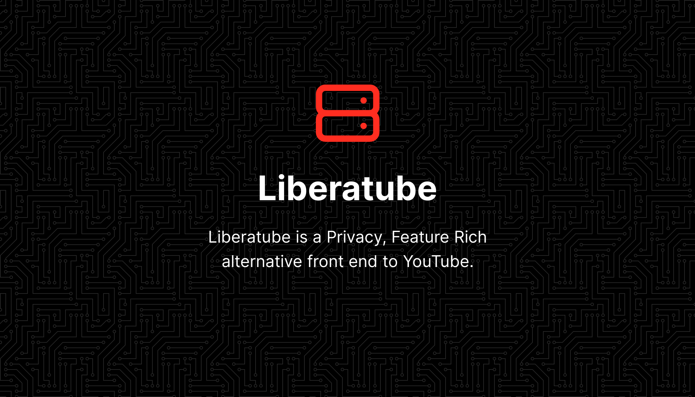
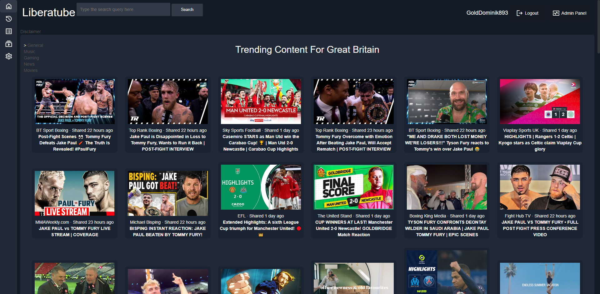
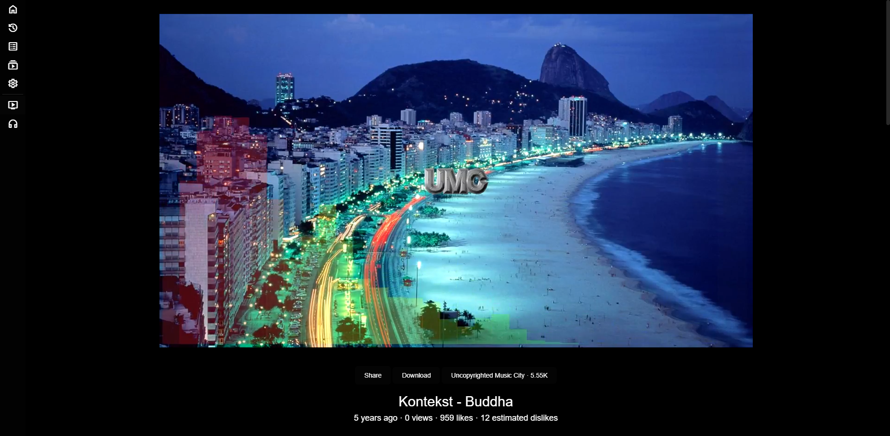
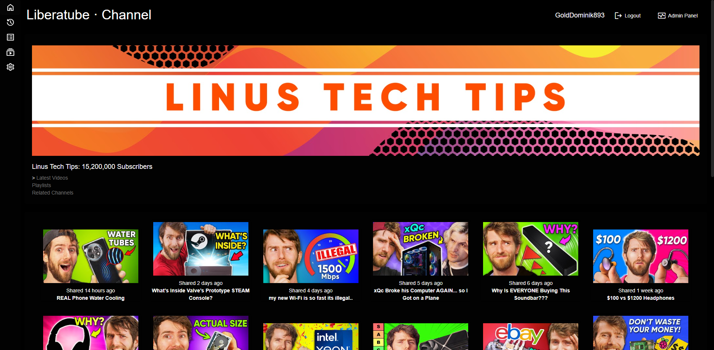
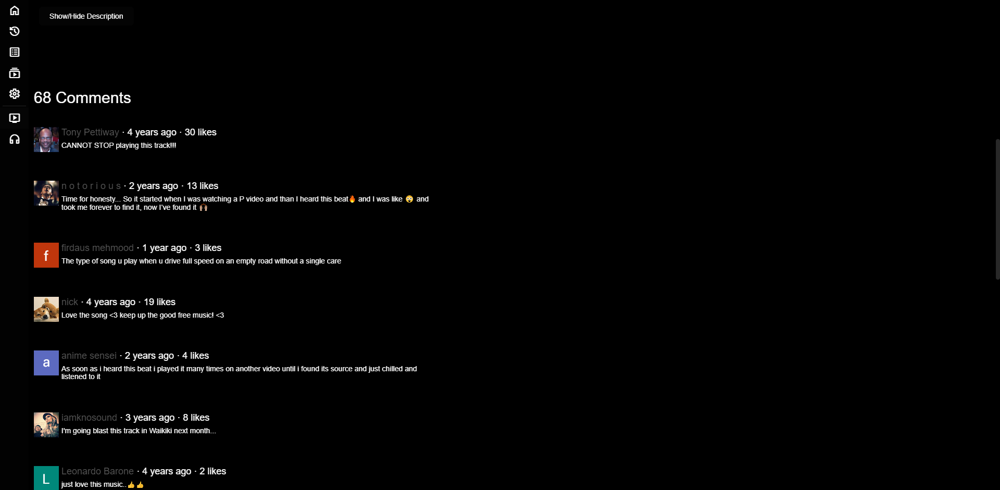
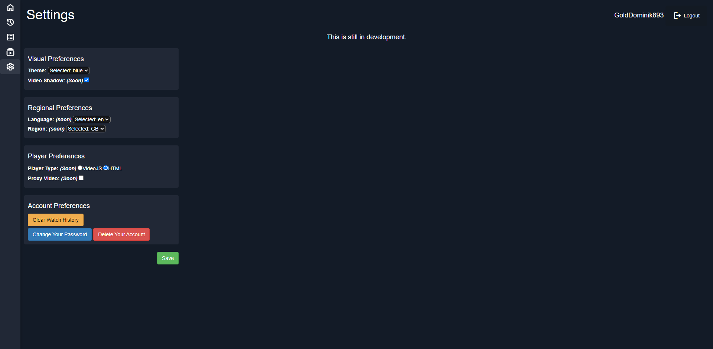

[](./LICENSE)
[](https://github.com/golddominik893/liberatube/releases/latest)
[](https://github.com/golddominik893/liberatube/commits)
[](https://github.com/golddominik893/liberatube/issues)
[](https://github.com/golddominik893/liberatube/pulls)
[](https://github.com/GoldDominik893/liberatube/actions/workflows/build-amd64.yml)
[](https://github.com/GoldDominik893/liberatube/actions/workflows/build-arm64.yml)

## Table of Contents

* [Screenshots](#screenshots)
* [Features](#features)
* [To do](#to-do)
* [Related Repositories](#related-repositories)
* [Instances](#instances)
* [Installation](#installation)
  * [Docker](#docker)
  * [Native](#native)
* [Documentation](#documentation)
* [License](#license)
  * [Liability](#liability)

## Screenshots

| Home                      | Video              |
|-------------------------------------|-------------------------------------|
|     |  |

| Channel                        | Comments             | Settings      |
|-------------------------------------|-------------------------------------|---------------------------------------|
|    |  |  |

## Features

* Lightweight
* No ads
* No tracking
* Blue/Ultra dark themes
* Audio-only mode
* Return YouTube Dislike
* Download videos
* Does not use official YouTube API's
* Docker compose file

## To do

* DASH/HLS video through VideoJS.
* Autoplay for playlists.
* Sort videos on a users channel by date and popularity.
* Clickable timestamps from description or comments.
* Native language support.
* Playlist creation.
* Subscribing to channels.
* Caching the trending page to reduce loading times significantly.
* Annotations (clickable links on the video basically).

## Related Repositories

* [Liberatube](//github.com/golddominik893/liberatube) - This Repository.
* [Liberatube Redirector](//github.com/golddominik893/liberatube-redirector) - A Chrome extension that automatically redirects YouTube links to Liberatube.
* [Liberatube Documentation](//github.com/golddominik893/liberatube-docs) - Documentation for Liberatube.
* [Liberatube Instances](//github.com/golddominik893/liberatube-instances) - Instance switcher website.
* [Liberatube Plugin Store](//github.com/golddominik893/liberatube-pluginstore) - The community driven plugin store for Liberatube.
  
## Instances

Check the [Documentation](https://liberatube-docs.epicsite.xyz/general/2.instances/).

## Installation

### Docker

You can build an image yourself using the compose file provided, ensure that you have docker and docker compose installed.

You also need to edit the `config.php` file to uncomment and recomment some lines for the sql credentials.

```bash
git clone https://github.com/GoldDominik893/liberatube.git
cd liberatube/
nano config.php
sudo docker-compose up -d --build
```

### Native

Check the [Documentation](https://liberatube-docs.epicsite.xyz/installation/1.prerequisites/).

## Documentation

If you need help regarding this software please check the [Documentation](http://liberatube-docs.epicsite.xyz/) first before opening an issue or a discussion.

## [License](./LICENSE)

Liberatube is licensed under the GNU Affero General Public License v3.0

Copyright © 2024 Dominic Wajda

### Liability

We take no responsibility for the use of our tool, or external instances
provided by third parties. We strongly recommend you abide by the valid
official regulations in your country. Furthermore, we refuse liability
for any inappropriate use of Liberatube, such as illegal downloading.
This tool is provided to you in the spirit of free, open software.

You may view the LICENSE in which this software is provided to you [here](./LICENSE).

>   16. Limitation of Liability.
>
> IN NO EVENT UNLESS REQUIRED BY APPLICABLE LAW OR AGREED TO IN WRITING
WILL ANY COPYRIGHT HOLDER, OR ANY OTHER PARTY WHO MODIFIES AND/OR CONVEYS
THE PROGRAM AS PERMITTED ABOVE, BE LIABLE TO YOU FOR DAMAGES, INCLUDING ANY
GENERAL, SPECIAL, INCIDENTAL OR CONSEQUENTIAL DAMAGES ARISING OUT OF THE
USE OR INABILITY TO USE THE PROGRAM (INCLUDING BUT NOT LIMITED TO LOSS OF
DATA OR DATA BEING RENDERED INACCURATE OR LOSSES SUSTAINED BY YOU OR THIRD
PARTIES OR A FAILURE OF THE PROGRAM TO OPERATE WITH ANY OTHER PROGRAMS),
EVEN IF SUCH HOLDER OR OTHER PARTY HAS BEEN ADVISED OF THE POSSIBILITY OF
SUCH DAMAGES.
