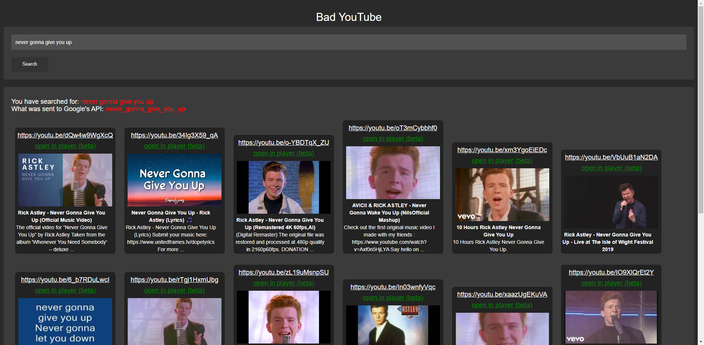
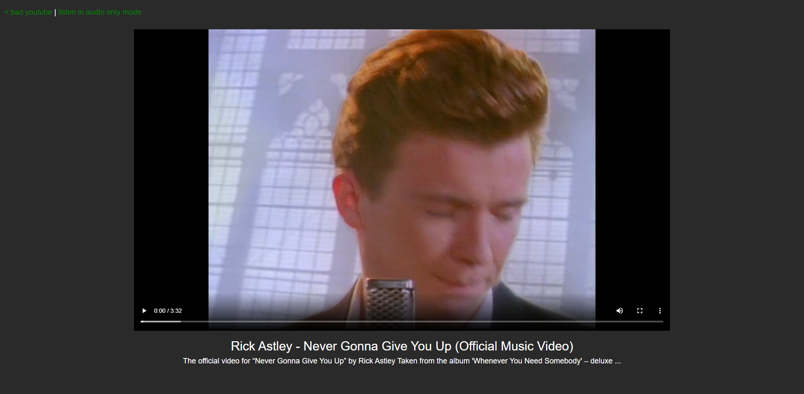
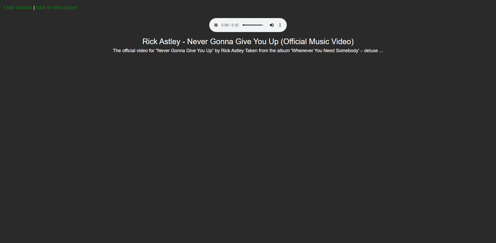

  <h1>Bad YouTube</h1>

A YouTube alternative like Invidious but in PHP and also uses Google's API meaning you need to provide you own API key.

## Screenshots

## Instances of Bad YouTube
I myself host [two.epicfaucet.gq](https://two.epicfaucet.gq)
If you want to add your instance of Bad YouTube to this list please email [admin@epicsite.xyz](admin@epicsite.xyz)

## Installation
Download the zip from [here](https://github.com/GoldDominik893/bad-youtube/archive/refs/heads/main.zip) and extract. Edit index.php and put in you own API key where it says YOUR_API_KEY then you can just put it in the website docs of any hosting software that supports php or any web host.
You can get an API key from [here](https://console.cloud.google.com)
